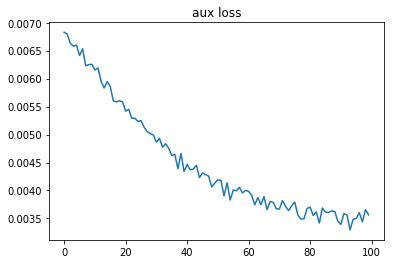

**Grid World X,Y example**

A basic example of using Keras and machine learning with a grid world.
The model is a copy of same convolutional Q learning network used in many
of the Atari game solving papers. With an additional "head" that learns other
domian specific knowlege that is either useful in it's own right or helps the 
main model to learn faster.

In this simplified example the auxilary doesn't speed convergence of the Q score,
however other experiments have shown it to be helpful in terms of sample effeciency.

**Grid World**

This example grid world has a blue player, a green goal and a red failure location.

**Grid Coordinates**

In this sample you can see the probability the grid world assigns to the player being
in each location. It's output is a softmax(-dist) to each cell.

When trained the network will predict the most likely location of the player.

Note that this method with work with just the distances from the corners, but it 
will converge faster if you can supply more cells.

** Training Results **

In this toy example you can see the model converges quite quickly for the "auxilary"
data.

Q_value loss is converging but at a much slower rate. My other experiments with reinforcement
learning showed a big advantage to using an auxillary head with domain knowlege in terms
of sample effeciency. It's not helpful in this toy example.

**Notes:**

There is some target network code in the Keras model that is not used in this example that 
helps with network stability when doing Reinforcement Learning. Removed from this example for 
brevity and clarity.

**Usage**

$ python grid_x_y_predict.py

**Requires**
keras with tensorflow, numpy, matplotlib, and skimage.transform

**See Also**
[Deep Reinforcement Learning: Pong from Pixels](http://karpathy.github.io/2016/05/31/rl/)

["auxillary Reward Architecture for Reinforcement Learning", Seijen et al.](https://arxiv.org/pdf/1706.04208.pdf)

["REINFORCEMENT LEARNING WITH UNSUPERVISED AUXILIARY TASKS", Jaderberg et al.](https://arxiv.org/pdf/1611.05397.pdf)
